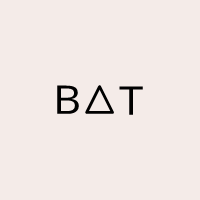
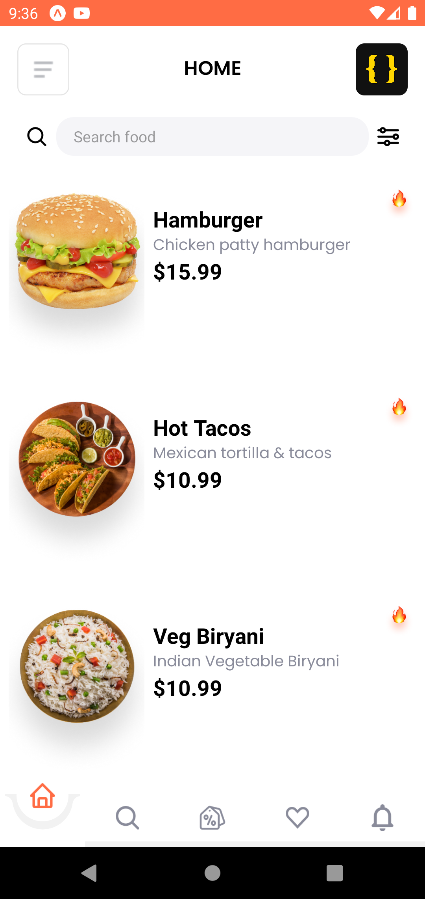

<!-- Improved compatibility of back to top link: See: https://github.com/alisalim17/bat/pull/73 -->
<a name="readme-top"></a>
<!--
*** Thanks for checking out the bat. If you have a suggestion
*** that would make this better, please fork the repo and create a pull request
*** or simply open an issue with the tag "enhancement".
*** Don't forget to give the project a star!
*** Thanks again! Now go create something AMAZING! :D
-->


<!-- PROJECT SHIELDS -->
<!--
*** I'm using markdown "reference style" links for readability.
*** Reference links are enclosed in brackets [ ] instead of parentheses ( ).
*** See the bottom of this document for the declaration of the reference variables
*** for contributors-url, forks-url, etc. This is an optional, concise syntax you may use.
*** https://www.markdownguide.org/basic-syntax/#reference-style-links
-->
[![Contributors][contributors-shield]][contributors-url]
[![Forks][forks-shield]][forks-url]
[![Stargazers][stars-shield]][stars-url]
[![Issues][issues-shield]][issues-url]
[![MIT License][license-shield]][license-url]
<!-- [![LinkedIn][linkedin-shield]][linkedin-url] -->


<!-- PROJECT LOGO -->
<br />
<div align="center">
  <a href="https://github.com/alisalim17/bat">
    
  </a>

  <h3 align="center">Bat</h3>

  <p align="center">
    An awesome Food Delivery App Clone!
    <br />
    <a href="https://github.com/alisalim17/bat"><strong>Explore the docs »</strong></a>
    <br />
    <br />
    <a href="https://expo.dev/@quantum17/bat">View Demo</a>
    ·
    <a href="https://github.com/alisalim17/bat/issues">Report Bug</a>
    ·
    <a href="https://github.com/alisalim17/bat/issues">Request Feature</a>
  </p>
</div>


<details>
  <summary>Table of Contents</summary>
  <ol>
    <li>
      <a href="#about-the-project">About The Project</a>
      <ul>
        <li><a href="#built-with">Built With</a></li>
      </ul>
    </li>
    <li>
      <a href="#getting-started">Getting Started</a>
      <ul>
        <li><a href="#installation">Installation</a></li>
      </ul>
    </li>
    <li><a href="#usage">Usage</a></li>
    <li><a href="#contributing">Contributing</a></li>
    <li><a href="#contact">Contact</a></li>
    <li><a href="#note">Note</a></li>
    <!-- <li><a href="#acknowledgments">Acknowledgments</a></li> -->
  </ol>
</details>


<!-- ABOUT THE PROJECT -->
## About The Project



I created an app for practice in React Native/Expo.

This was a real app that I made

<p align="right">(<a href="#readme-top">back to top</a>)</p>


### Built With

This section should list any major frameworks/libraries used to bootstrap your project. Leave any add-ons/plugins for the acknowledgements section. Here are a few examples.

- React.js
- React Native 
- Expo
- Tailwind CSS for react native
- React Navigation v6


<p align="right">(<a href="#readme-top">back to top</a>)</p>


<!-- GETTING STARTED -->
## Getting Started

This is an example of how you may give instructions on setting up "bat" locally.
To get a local copy up and running follow these simple example steps.

### Installation

1. Clone the repo
   ```sh
   git clone https://github.com/alisalim17/bat.git
   ```
2. Install packages
   ```sh
   yarn
   ```
3. Start the project
   ```sh
   yarn start
   ```

<p align="right">(<a href="#readme-top">back to top</a>)</p>


<p align="right">(<a href="#readme-top">back to top</a>)</p>


See the [open issues](https://github.com/alisalim17/bat/issues) for a full list of proposed features (and known issues).

<p align="right">(<a href="#readme-top">back to top</a>)</p>


<!-- CONTRIBUTING -->
## Contributing

Contributions are what make the open source community such an amazing place to learn, inspire, and create. Any contributions you make are **greatly appreciated**.

If you have a suggestion that would make this better, please fork the repo and create a pull request. You can also simply open an issue with the tag "enhancement".
Don't forget to give the project a star! Thanks again!

1. Fork the Project
2. Create your Feature Branch (`git checkout -b feature/AmazingFeature`)
3. Commit your Changes (`git commit -m 'Add some AmazingFeature'`)
4. Push to the Branch (`git push origin feature/AmazingFeature`)
5. Open a Pull Request

<p align="right">(<a href="#readme-top">back to top</a>)</p>

<!-- CONTACT -->
## Contact

Ali Salimli - [@elisalimli](https://twitter.com/elisalimli) - alisalimli.info@gmail.com


<p align="right">(<a href="#readme-top">back to top</a>)</p>


<!-- ACKNOWLEDGMENTS -->
<!-- ## Acknowledgments -->


## Note
Design doesn't belong to me, check the youtube video => https://www.youtube.com/watch?v=diUDjNwZ8Lg&ab_channel=ByProgrammers

<p align="right">(<a href="#readme-top">back to top</a>)</p>


<!-- MARKDOWN LINKS & IMAGES -->
<!-- https://www.markdownguide.org/basic-syntax/#reference-style-links -->
[contributors-shield]: https://img.shields.io/github/contributors/alisalim17/bat.svg?style=for-the-badge
[contributors-url]: https://github.com/alisalim17/bat/graphs/contributors
[forks-shield]: https://img.shields.io/github/forks/alisalim17/bat.svg?style=for-the-badge
[forks-url]: https://github.com/alisalim17/bat/network/members
[stars-shield]: https://img.shields.io/github/stars/alisalim17/bat.svg?style=for-the-badge
[stars-url]: https://github.com/alisalim17/bat/stargazers
[issues-shield]: https://img.shields.io/github/issues/alisalim17/bat.svg?style=for-the-badge
[issues-url]: https://github.com/alisalim17/bat/issues
[license-shield]: https://img.shields.io/github/license/alisalim17/bat.svg?style=for-the-badge
[license-url]: https://github.com/alisalim17/bat/blob/master/LICENSE.txt
<!-- [linkedin-shield]: https://img.shields.io/badge/-LinkedIn-black.svg?style=for-the-badge&logo=linkedin&colorB=555 -->
<!-- [linkedin-url]: https://linkedin.com/in/alisalim17 -->
[product-screenshot]: assets/images/screenshoot_1.png
[React.js]: https://img.shields.io/badge/React-20232A?style=for-the-badge&logo=react&logoColor=61DAFB
[React-url]: https://reactjs.org/
